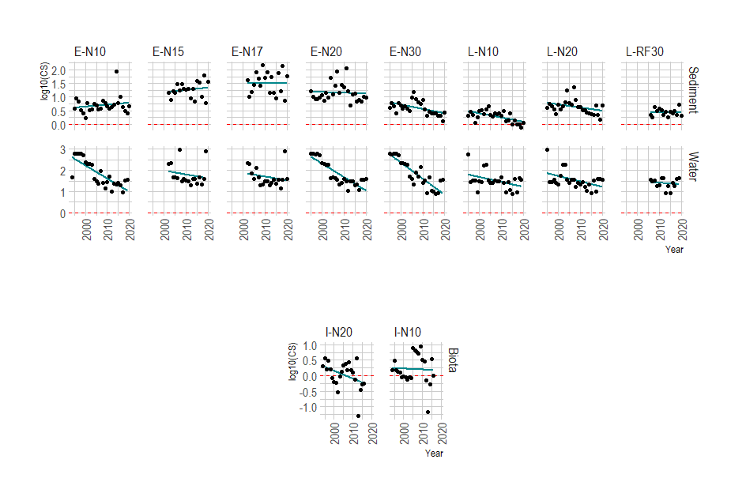

# ETC-ICM trends Nervion
ETC-ICM task on environmental trends - CHASE Hazardous substances status for Nervión estuary

### Contents

* [Nervión](#nervión)
* [Import data](#import-to-r)
* [CHASE Method](#chase-method)
* [CHASE Results](#chase-results)

### Nervión


### Import data

The folder [data](/data/) contains the input data for the assessments.

Data received from AZTI in the file `ETC ICM task 1.6.2.1 data contaminants Nervión estuary for temporal trends.xls` is read into an R data frame using [Nervion_read_data.R](/Nervion_read_data.R). The data frame is saved as an R data file `data_from_Mersin.Rda`

```
xlfile<-"data/ETC ICM task 1.6.2.1 data contaminants Nervión estuary for temporal trends.xls"

dfStn <- read_xls(xlfile,sheet="Sampling locations coordinates")
dfW <- read_xls(xlfile,sheet="Water")
dfS <- read_xls(xlfile,sheet="Sediment")
dfB <- read_xls(xlfile,sheet="Biota")
```

### CHASE Method

*comments needed*


### CHASE Results




