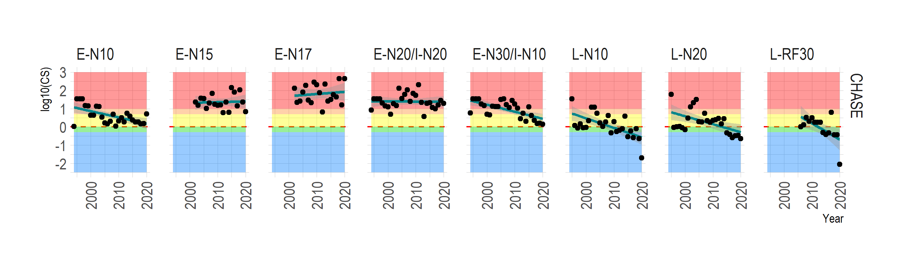
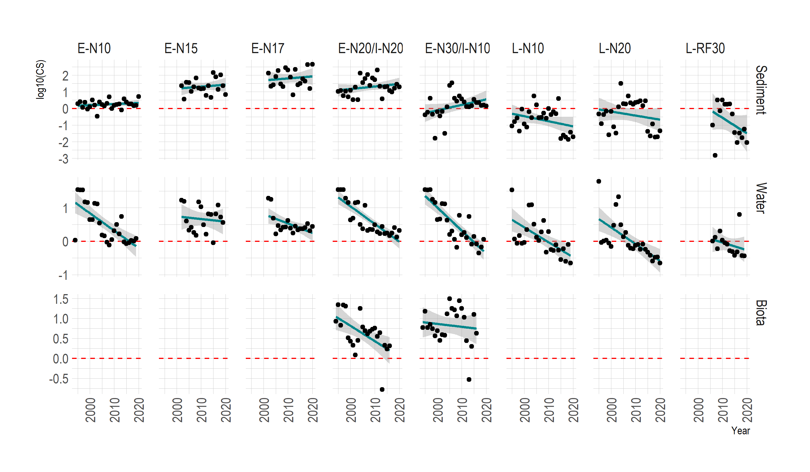
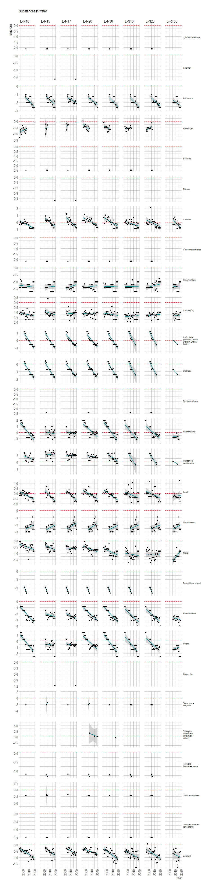
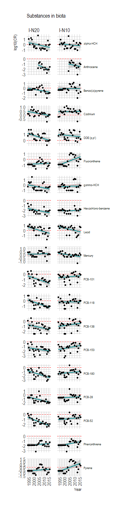

# ETC-ICM trends Nervion
ETC-ICM task on environmental trends - CHASE Hazardous substances status for Nervión estuary

### Contents

* [Nervión](#nervión)
* [Import data](#import-to-r)
* [CHASE Method](#chase-method)
* [CHASE Results](#chase-results)
* [Supplementary Results](#supplementary-results)

### Nervión


### Import data

The folder [data](/data/) contains the input data for the assessments.

Data received from AZTI in the file `ETC ICM task 1.6.2.1 data contaminants Nervión estuary for temporal trends.xls` is read into an R data frame using [Nervion_read_data.R](/Nervion_read_data.R). The data frame is saved as an R data file `data_from_Mersin.Rda`

```
xlfile<-"data/ETC ICM task 1.6.2.1 data contaminants Nervión estuary for temporal trends.xls"

dfStn <- read_xls(xlfile,sheet="Sampling locations coordinates")
dfW <- read_xls(xlfile,sheet="Water")
dfS <- read_xls(xlfile,sheet="Sediment")
dfB <- read_xls(xlfile,sheet="Biota")
```

### CHASE Method
More details of the CHASE method can be found in [Andersen et al. (2016)](https://link.springer.com/article/10.1007/s10661-016-5121-x)

Very briefly;

* We compare measurements of hazardous substances in three categories (phases): 1) Water, 2) Sediment and 3) Biota.

* The average concentration of each substance is calculated for each year and sampling station. This is done for the substances for which there is a recognized threshold value: [thresholds_Nervion_CHASE.xlsx](data/thresholds_Nervion_CHASE.xlsx). This is done by taking the log-mean average.

* For each substance , the Contamination Ratio is calculated as the ratio of the mean concentration to the threshold value.

* The Contamination Score (CS) is calculated according to the CHASE method, as the sum of CR values divided by the square-root of the number of substances included/observed.

* The contamination score is caclulated for each of the three categories.

* A score greater than 1.0 indicates a contamination problem area. A score less than 1.0 indicates that this is not a problem area.

Fig. 2 shows the number of stations each year with data within each category.


### CHASE Results

Fig. 3 shows the CHASE Contamination Sum score at each of the eight sediment/water stations.
Biota measurements are made at two separate stations and the contamination scores for this category are consistently lower than thos for sediment and water. So, even if we found a grouping of biota and sediment/water sampling points, the biota category contamination scores would have no influence on the overall results.



The next figure (Fig. 4) shows the contamination scores within each category. 



### Supplementary Results

Here the contamination ratios for individual substances are shown. This allows us to see which substances are responsible for the overall status withn each category:

* [Sediment](#contamination-ratios-for-substances-in-sediment)
* [Water](#contamination-ratios-for-substances-in-water)
* [Biota](#contamination-ratios-for-substances-in-biota)

#### Contamination ratios for substances in sediment


<br><br><br><br>

#### Contamination ratios for substances in water




<br><br><br><br>

#### Contamination ratios for substances in biota




